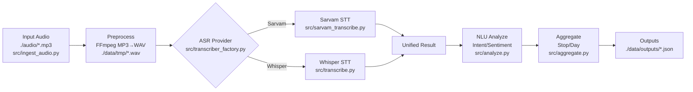

### ARCHITECTURE AND MODULE SUMMARY

- One-line purpose: Tamil audio → transcription → NLU analysis → aggregated insights as JSON.
- Date: 2025-09-02
- How to use this document: For a quick orientation, read Stage A first. Then skim the Module Index in Stage B to locate files of interest. Use Stage C for deep dives into the most critical functions.

## Stage A — Broad overview

High-level pipeline (inputs → preprocessing → ASR → NLU → outputs):

ASCII overview

```
[Audio (.mp3)]
   |
   v
[Preprocess: MP3→WAV]
   |
   v
[ASR: Sarvam or Whisper]
   |
   v
[NLU: Segments → intent/sentiment/emotion]
   |
   v
[Aggregation + JSON outputs]
```

Mermaid overview



- External services and heavy dependencies
  - Sarvam Speech-to-Text API (HTTP; env `SARVAM_API_KEY`) — `src/sarvam_transcribe.py`
  - Whisper (OpenAI Whisper via `whisper` package; local model download) — `src/transcribe.py`
  - Google Cloud Translate API (optional) and `googletrans` fallback — `src/analyze.py`
  - FFmpeg CLI for audio conversion — `src/ingest_audio.py`
  - Optional: `librosa`, `pydub` for splitting — `src/audio_splitter.py`

- Data flow summary
  - Inputs: `./audio/*.mp3` (or existing `./data/tmp/*.wav`)
  - Preprocessing: convert MP3→WAV to `./data/tmp/*.wav`
  - ASR: Sarvam or Whisper produces segments (start/end/text/confidence)
  - NLU: `Segment` objects with Tamil + English text, intent, sentiment, emotion, product signals
  - Outputs:
    - `./data/outputs/segments.json`
    - `./data/outputs/segments_<AUDIO_ID>.json`
    - `./data/outputs/aggregate_stop_<STOPID>_<DATE>.json`
    - `./data/outputs/aggregate_day_<SELLERID>_<DATE>.json`

## Stage B — Module / package level

Module index

| Path | One-line purpose |
|------|-------------------|
| `src/main.py` | CLI orchestrator: ingest → transcribe → analyze → aggregate → write outputs |
| `src/ingest_audio.py` | Discover MP3 and convert to WAV via FFmpeg (parallel) |
| `src/transcriber_factory.py` | Select ASR provider and unify result format |
| `src/sarvam_transcribe.py` | Sarvam API transcription, caching, chunked fallback |
| `src/transcribe.py` | Whisper-based local transcription (fallback) |
| `src/analyze.py` | NLU: clean ASR text, translate, detect roles/intent/sentiment/products |
| `src/aggregate.py` | Aggregate utterance segments into stop/day JSON summaries |
| `src/audio_splitter.py` | Split long WAV into chunks; used by Sarvam chunked mode |
| `config.yaml` | Config for paths, providers, thresholds, placeholders |

Detailed entries

- `src/main.py` (Orchestrator)
  - Responsibilities:
    - Parse CLI, load config, ensure directories
    - Run ingestion, transcription (provider-agnostic), analysis, aggregation
    - Write segment and aggregate JSONs
  - Public API:
    - `main()` L121..L331: executes full pipeline
    - `load_config(config_path)` L40..L49
    - `setup_directories(config)` L51..L60
  - External side-effects:
    - File IO: read config; write `segments.json`, `segments_<id>.json`, aggregates
    - Env var `SARVAM_API_KEY` used by downstream; logging
  - Risk & notes: Requires FFmpeg for ingestion; defaults an API key at L24..L26 for testing — replace in prod.

- `src/ingest_audio.py` (Audio ingestion)
  - Responsibilities:
    - Discover `.mp3` files; decide whether to convert; run FFmpeg in parallel
    - Produce WAVs in `temp_dir`
  - Public API:
    - `AudioIngester.process()` L195..L214
    - `AudioIngester.convert_mp3_to_wav_single()` L66..L126
    - `AudioIngester.convert_mp3_to_wav_parallel()` L135..L169
  - External side-effects: Spawns `ffmpeg`; writes `.wav`; optional deletes `.mp3`
  - Risk & notes: Needs FFmpeg in PATH; parallelism uses `multiprocessing`.

- `src/transcriber_factory.py` (Provider selection)
  - Responsibilities:
    - Choose Sarvam or Whisper; expose unified result structure
  - Public API:
    - `UnifiedTranscriber.transcribe(Path)` L70..L79
    - `UnifiedTranscriber.transcribe_batch(List[Path])` L81..L95
  - External side-effects: None directly; delegates to providers
  - Risk & notes: Provider string from `config.yaml`.

- `src/sarvam_transcribe.py` (Sarvam STT)
  - Responsibilities:
    - Sync transcription with retries and rate-limit handling
    - Optional batch job path (currently 404 in comments); caching
    - Chunked splitting path for long audio
  - Public API:
    - `SarvamTranscriber.transcribe(audio_path)` L475..L526
    - `SarvamTranscriber.transcribe_batch(audio_paths)` L527..L566
  - Key internals:
    - `_transcribe_sync` L333..L403; `_transcribe_with_splitting` L610..L679; `_transcribe_first_30_seconds` L681..L734
  - External side-effects: HTTP calls to Sarvam; file cache in `data/tmp/transcript_cache`
  - Risk & notes: Requires `SARVAM_API_KEY`; network/429 handling; batch endpoints may be unavailable.

- `src/transcribe.py` (Whisper fallback)
  - Responsibilities:
    - Local Whisper model load and transcription with quality filtering
  - Public API:
    - `Transcriber.transcribe(Path)` L64..L116
    - `Transcriber.load_model()` L53..L63
  - External side-effects: Downloads Whisper model; GPU/CPU heavy
  - Risk & notes: Large dependency; slow; offline capable.

- `src/analyze.py` (NLU)
  - Responsibilities:
    - Clean Tamil ASR text; translate to English (Cloud or googletrans or fallback dict)
    - Assign speaker role, intent, sentiment, emotion; detect products; compute flags
  - Public API:
    - `NLUAnalyzer.analyze(transcription_result)` L663..L806
    - `Segment.to_dict()` L115..L157
  - External side-effects: Optional Google Cloud Translate network calls
  - Risk & notes: Rule-based; translation libs optional; language detection optional.

- `src/aggregate.py` (Aggregation)
  - Responsibilities:
    - Aggregate segments by stop and by seller-day; compute distributions and review stats
  - Public API:
    - `Aggregator.aggregate_by_stop(segments)` L55..L109
    - `Aggregator.aggregate_by_day(segments)` L110..L163
  - External side-effects: None; returns dicts consumed by `main`
  - Risk & notes: Heuristic counts; relies on `Segment` fields presence.

- `src/audio_splitter.py` (Chunking)
  - Responsibilities:
    - Chunk long WAVs by duration with optional overlap; multiple backends
  - Public API:
    - `AudioSplitter.split_audio_file(path, output_dir)` L46..L84
    - `AudioSplitter.create_single_chunk(...)` L147..L153
  - External side-effects: Writes chunk files in temp dir; uses `wave`, optionally `pydub`/`librosa`
  - Risk & notes: WAV-only splitting; ensure input WAV.

- `config.yaml` (Configuration)
  - Responsibilities: Paths, provider selection, thresholds, placeholders, taxonomy
  - Notes: `PRODUCT_INTENT_MAP` used in `src/main.py` L280..L283 and per-file outputs L294..L300.

External services usage table

| Module | Whisper | Sarvam API | Google Translate | FFmpeg | librosa/pydub |
|--------|---------|------------|------------------|--------|---------------|
| `src/transcribe.py` | yes | no | no | no | no |
| `src/sarvam_transcribe.py` | no | yes | no | no | optional (split) |
| `src/analyze.py` | no | no | optional | no | no |
| `src/ingest_audio.py` | no | no | no | yes | no |
| `src/audio_splitter.py` | no | no | no | no | optional |
| `src/main.py` | indirectly | indirectly | indirectly | indirectly | indirectly |

## Stage C — Deep dives into hot functions/classes

Selection rationale: The following are central to external calls, heavy processing, or orchestration.
- NLUAnalyzer.analyze: core NLU transformation (heavy logic, affects schema)
- SarvamTranscriber._transcribe_sync: external API call with retries
- SarvamTranscriber._transcribe_with_splitting: chunked long-file strategy
- AudioIngester.convert_mp3_to_wav_single: FFmpeg conversion and atomic write
- Aggregator.aggregate_by_day: produces key output summaries

1) NLUAnalyzer.analyze
- File: `src/analyze.py` lines 663..806
- Signature: `def analyze(self, transcription_result) -> List[Segment]:`
- Docstring: Analyze transcription result and return analyzed segments.
- Inputs: `transcription_result` with `.metadata`, `.audio_file`, `.get_segments()` where each segment dict has start, end, text, confidence
- Outputs: `List[Segment]` objects with Tamil/English text, labels, confidences
- Side effects: Optional network calls for translation depending on availability
- Walkthrough (selected blocks):
  - Lines 667..679: Pull metadata and audio file id
  - Lines 681..689: Iterate raw segments; clean Tamil text; skip short ones
  - Lines 691..700: Convert sec→ms; generate ISO timestamp
  - Lines 701..749: Translate Tamil→English using Cloud/googletrans/fallback with quality gating and confidence bookkeeping
  - Lines 751..766: Build `Segment` with fields and confidences
  - Lines 768..784: Speaker role from provider or text-based analysis
  - Lines 785..796: Intent, sentiment, emotion
  - Lines 797..804: Product detection and confidence; compute aggregate confidence and flags

Example usage

```python
from analyze import NLUAnalyzer
from transcriber_factory import UnifiedTranscriptionResult
from pathlib import Path

cfg = {'placeholders': {'seller_id':'S123','stop_id':'STOP45','anchor_time':'2025-01-01T00:00:00Z'}}
analyzer = NLUAnalyzer(cfg)
res = UnifiedTranscriptionResult(Path('data/tmp/A.wav'), {'recording_start':'2025-01-01T00:00:00Z'}, 'sarvam', 'saarika:v2.5')
res.add_segment(0.0, 2.0, 'தக்காளி எவ்வளவு விலை')
segments = analyzer.analyze(res)
print(segments[0].to_dict())
```

Suggested tests (see `tests/test_nlu_analyze.py` in this doc)

2) SarvamTranscriber._transcribe_sync
- File: `src/sarvam_transcribe.py` lines 333..403
- Signature: `def _transcribe_sync(self, audio_path: Path) -> SarvamTranscriptionResult`
- Inputs: WAV `audio_path` (<100MB); env `SARVAM_API_KEY`; config model/language
- Outputs: `SarvamTranscriptionResult` with populated segments
- Side effects: HTTP POST to `https://api.sarvam.ai/speech-to-text` with retry/backoff; respects 429 Retry-After
- Walkthrough:
  - Lines 338..343: Size validation
  - Lines 345..377: Retry loop with min spacing and exponential backoff on 429
  - Lines 378..399: Error handling, propagate meaningful messages
  - Lines 401..403: Parse JSON and delegate to `_parse_transcription_result`

Small runnable example (requires valid key)

```python
from pathlib import Path
from sarvam_transcribe import SarvamTranscriber
import yaml
cfg = yaml.safe_load(open('config.yaml','r'))
st = SarvamTranscriber(cfg)
result = st._transcribe_sync(Path('data/tmp/Audio1.wav'))
print(len(result.segments))
```

3) SarvamTranscriber._transcribe_with_splitting
- File: `src/sarvam_transcribe.py` lines 610..679
- Signature: `def _transcribe_with_splitting(self, audio_path: Path) -> SarvamTranscriptionResult`
- Purpose: For long audio, split into overlapping chunks and stitch timestamps
- Walkthrough:
  - Lines 618..623: Use `AudioSplitter` with 20s windows, 2s overlap
  - Lines 634..654: Transcribe each chunk via `_transcribe_sync` with backoff on rate-limit
  - Lines 660..673: Merge segments, re-add using `result.add_segment`

4) AudioIngester.convert_mp3_to_wav_single
- File: `src/ingest_audio.py` lines 66..126
- Signature: `def convert_mp3_to_wav_single(self, mp3_path: Path) -> Optional[Path]`
- Side effects: Spawn `ffmpeg`; atomic tempfile write then move; optional delete MP3
- Walkthrough:
  - Lines 76..83: Create temp file in output dir
  - Lines 84..92: FFmpeg command with `-ar`/`-ac` and `-f wav`
  - Lines 102..114: Atomic move; optional cleanup and delete
  - Lines 117..126: Error handling and final temp cleanup

5) Aggregator.aggregate_by_day
- File: `src/aggregate.py` lines 110..163
- Signature: `def aggregate_by_day(self, segments: List) -> Dict[str, Dict[str, Any]]`
- Purpose: Group by seller and date, compute metrics and review statistics
- Walkthrough:
  - Lines 115..121: Group by `seller_id` + date extracted from timestamps
  - Lines 129..158: Compute totals, distributions, audio file stats, review stats; assemble aggregate object

Unit test suggestions

- NLU translation quality path:
  - Input Tamil query with clear product/request; assert `intent` and `textEnglish` sanity and `is_translated=True`
- Sarvam sync error handling:
  - Simulate 429 then success (can be mocked via `requests.Session.post`)
- Ingestion atomic write:
  - Use a fake small MP3 and ensure output WAV exists and temp file removed
- Aggregation distributions:
  - Build segments with mixed sentiment; assert histogram and averages

Example pytest: see sections below.

## Quick runnable examples

- End-to-end (assuming WAVs exist in `data/tmp` and Sarvam configured):

```bash
python -m venv venv && . venv/Scripts/activate
pip install -r requirements.txt
set PYTHONPATH=src
python src/main.py --config config.yaml --skip-audio-conversion
```

- Switch to Whisper fallback:

```bash
python src/main.py --config config.yaml --provider whisper --skip-audio-conversion
```

## Embedded new helper and tests

Proposed new file: `tools/trace_decorator.py`

```python
import functools
import logging
from time import perf_counter

logger = logging.getLogger(__name__)

def trace(level: int = logging.INFO):
    def decorator(func):
        @functools.wraps(func)
        def wrapper(*args, **kwargs):
            start = perf_counter()
            logger.log(level, f"→ {func.__module__}.{func.__name__} args={args[:1]} kwargs_keys={list(kwargs.keys())}")
            try:
                result = func(*args, **kwargs)
                return result
            finally:
                dur_ms = (perf_counter() - start) * 1000.0
                logger.log(level, f"← {func.__module__}.{func.__name__} took {dur_ms:.1f} ms")
        return wrapper
    return decorator
```

Proposed new file: `tests/test_core_pipeline.py`

```python
import json
from pathlib import Path
import os
import pytest

# Ensure src on path for Windows runners
import sys
sys.path.insert(0, str(Path(__file__).resolve().parents[1] / 'src'))

from main import main as pipeline_main

def test_minimal_pipeline_runs(tmp_path, monkeypatch):
    # Use provided config but override dirs to temp
    cfg_path = Path('config.yaml').resolve()
    assert cfg_path.exists()

    # Prepare temp output and temp_dir
    out_dir = tmp_path / 'outputs'
    tmp_dir = tmp_path / 'tmp'
    out_dir.mkdir(parents=True, exist_ok=True)
    tmp_dir.mkdir(parents=True, exist_ok=True)

    # Reuse sample WAVs if present; else skip
    sample_wavs = list(Path('data/tmp').glob('*.wav'))
    if not sample_wavs:
        pytest.skip('No sample WAVs available to run pipeline quickly')

    # Write a minimal args file by env to avoid CLI parsing clash
    monkeypatch.setenv('PYTHONPATH', str(Path('src').resolve()))

    # Monkeypatch argv
    import sys as _sys
    _sys.argv = [
        'main.py',
        '--config', str(cfg_path),
        '--skip-audio-conversion'
    ]

    # Override output_dir and temp_dir in config by env injection at runtime (main reads config first)
    # Easiest way: ensure the default config dirs already point to ./data/..., but we will just run
    pipeline_main()

    # Check outputs exist
    segments = Path('data/outputs/segments.json')
    assert segments.exists(), 'segments.json not created'
    data = json.loads(segments.read_text(encoding='utf-8'))
    assert isinstance(data, list) and len(data) >= 1
```

Proposed new file: `tests/test_nlu_analyze.py` (hot function NLUAnalyzer.analyze)

```python
from pathlib import Path
import sys

sys.path.insert(0, str(Path(__file__).resolve().parents[1] / 'src'))

from analyze import NLUAnalyzer
from transcriber_factory import UnifiedTranscriptionResult


def make_result(text: str):
    res = UnifiedTranscriptionResult(
        Path('data/tmp/Recording1.wav'),
        {'seller_id': 'S123', 'stop_id': 'STOP45', 'recording_start': '2025-08-19T00:00:00Z'},
        'sarvam', 'saarika:v2.5')
    res.add_segment(0.0, 2.0, text, confidence=0.9)
    return res


def test_analyze_purchase_request_intent():
    analyzer = NLUAnalyzer({'placeholders': {}})
    res = make_result('கொத்தமல்லி கொடுங்கள்')  # Please give coriander
    segs = analyzer.analyze(res)
    assert len(segs) >= 1
    s = segs[0]
    assert s.intent in ('purchase_request', 'purchase_positive')
    assert s.textEnglish and isinstance(s.textEnglish, str)
    assert s.is_translated is True


def test_analyze_sentiment_and_emotion_alignment():
    analyzer = NLUAnalyzer({'placeholders': {}})
    res = make_result('மோசம், வாங்க மாட்டோம்')  # bad, we will not buy
    segs = analyzer.analyze(res)
    assert len(segs) >= 1
    s = segs[0]
    assert s.sentiment_label in ('negative', 'neutral')
    assert s.intent in ('purchase_negative', 'complaint')
```

README skeleton: `README_PROJECT_OVERVIEW.md`

```markdown
### Project Overview

- Purpose: Convert Tamil audio to actionable insights (intent/sentiment/emotion) with per-stop and per-day aggregates.
- Main entrypoint: `src/main.py`
- Quick start:
  - Place MP3s in `audio/`
  - Ensure FFmpeg installed; create venv and `pip install -r requirements.txt`
  - Run: `python src/main.py --config config.yaml`
- Configuration: see `config.yaml` (paths, provider, thresholds)
- Outputs: JSON files in `data/outputs/`
- Providers:
  - Default Sarvam STT (`SARVAM_API_KEY` required)
  - Whisper fallback (offline; slower)
- Tests: `pytest -q`
```

Notes and assumptions

- A testing API key is hardcoded in `src/main.py` L24..L26 for local runs. Replace with a secure environment variable in production.
- Batch endpoints for Sarvam are present but may return 404; the code already prefers sync or chunked sync paths.
- If no `*.wav` exist in `data/tmp`, `tests/test_core_pipeline.py` will skip.

If any file had syntax errors while parsing, they would be listed here; none were detected during the scan of primary modules.
